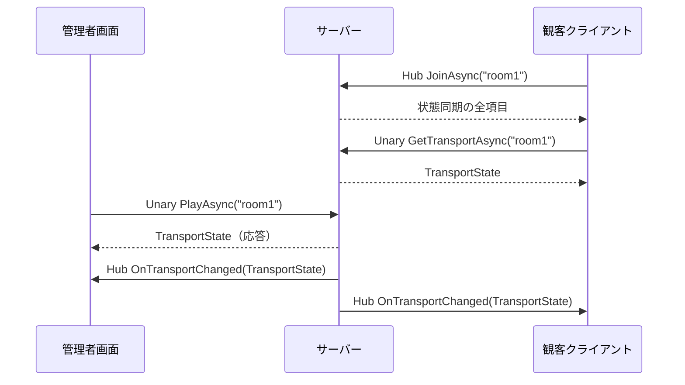

# サーバーとの通信（クライアント実装ガイド）

管理者画面と観客クライアントを実装する人向け。サーバーと何を、どの経路で、どの順に送受信するかを、例つきでまとめる。
用語は `Livisor.Server/Docs/Rules/glossary.md` に合わせる。

## 1. 前提

| 項目 | 内容 |
|---|---|
| サーバーのアドレス | `http://ホスト:5210`。HTTP/2 だけを受ける。`Assets/Network/ServerConfig.asset` に設定する |
| 通信ライブラリ | MagicOnion 7.10.2（`Assets/Packages`）。シリアライズは MessagePack |
| 通信契約 | `Livisor.Shared`。`Packages/manifest.json` から `file:../../Livisor.Shared` で参照する |
| チャネルの初期化 | `Assets/Scripts/MagicOnionInitializer.cs` がシーン読み込み前に `GrpcChannelProviderHost` を初期化する。HTTP/2 専用の `YetAnotherHttpHandler` を使う |
| IL2CPP（Meta Quest） | `Assets/Scripts/MagicOnionClientInitializer.cs` の `[MagicOnionClientGeneration(typeof(ITimelineService), typeof(IRoomStateHub))]` が必要。無いと接続時に落ちる。契約を増やしたらここにも足す |

## 2. 全体像

経路は 2 つ。操作は Unary で受け、配信は StreamingHub で行う。配るのは操作ではなく「確定した状態」。

| 経路 | 向き | 用途 | 契約 |
|---|---|---|---|
| Unary サービス | クライアント → サーバー（応答は本人だけ） | 再生開始・停止・スケジューリング・予約の取消・トランスポートの取得 | `ITimelineService` |
| StreamingHub | 双方向 | room への参加、状態同期の送信、サーバーからの通知 | `IRoomStateHub`、受信契約 `IRoomStateHubReceiver` |



Unary で受けた操作の結果も、StreamingHub の通知で同じ room の全接続へ届く。操作した本人にも届く。

## 3. 契約とデータ

### 3.1 Unary `ITimelineService`

| メソッド | 引数 | 応答 | 意味 |
|---|---|---|---|
| `GetTransportAsync` | roomId | `TransportState` | 現在のトランスポートを取る |
| `PlayAsync` | roomId | `TransportState` | 再生開始。開始時刻はサーバーが決める。再生中に呼んでも開始時刻は動かない |
| `StopAsync` | roomId | `TransportState` | 停止。予約アクションは残る |
| `ScheduleActionAsync` | roomId, `TimelineAction` | `TransportState` | 予約アクションを 1 件登録。前の 1 件を置き換える |
| `CancelScheduledActionAsync` | roomId | `TransportState` | 予約アクションを取り消す |

### 3.2 StreamingHub `IRoomStateHub` / 受信契約 `IRoomStateHubReceiver`

| メソッド | 向き | 内容 |
|---|---|---|
| `JoinAsync(roomId)` | クライアント → サーバー | room に参加する。応答は参加時点の状態同期の全項目（トランスポートは含まない）。別の room に参加し直すと前の room から抜ける |
| `PublishAsync(entries)` | クライアント → サーバー | 状態項目を送る。roomId は送らない（参加時の room をサーバーが覚えている）。応答は無し |
| `OnStateChanged(patch)` | サーバー → 全接続 | 変化した状態項目だけが届く |
| `OnTransportChanged(state)` | サーバー → 全接続 | トランスポートの全項目が届く |

### 3.3 データ

`TransportState`（毎回 4 項目すべて入る）

| 項目 | 型 | 意味 |
|---|---|---|
| `Playing` | bool | 再生中か |
| `StartedAtServerMs` | long | 再生開始のサーバー時刻（UTC ミリ秒）。停止中は 0 |
| `ServerTimeMs` | long | この通知を作ったサーバー時刻（送信時刻） |
| `ScheduledAction` | `TimelineAction?` | 予約アクション 1 件。無ければ null |

`TimelineAction`

| 項目 | 型 | 意味 |
|---|---|---|
| `Time` | string | 再生開始からの相対時間 `HH:mm:ss:ff`（時:分:秒:センチ秒）。例 `"00:01:30:00"` は 90 秒後 |
| `Action` | `ActionType` | `Play` または `VolumeChange` |
| `Value` | `ActionValue` | `Play` なら bool（true = 再生、false = 停止）、`VolumeChange` なら int |

`RoomStatePatch` は `Entries`（`RoomStateEntry[]`）と `ServerTimeMs`。`RoomStateEntry` は `Key`（string）と `Value`（`ActionValue`）。
既知キーは `RoomStateKeys.Volume`（`"volume"`、int）と `RoomStateKeys.HeartRate`（`"heartRate"`、int）。それ以外のキーも送れる。`playing` は送らない。

`ActionValue` は `ActionValue.From(int | bool | string)` で作る。`int`、`bool`、`string` からの暗黙変換もある。

## 4. 接続

画面側は MagicOnion を直接触らず、`Assets/Timeline/Scripts/IRoomClient.cs`（実装 `RoomClient.cs`）を使う。

```csharp
var client = new RoomClient();
client.TransportChanged += state => { /* 非メインスレッド。キューに積む */ };
client.StateChanged += patch => { /* 同上 */ };
await client.ConnectAsync("http://localhost:5210", "room1");
```

`ConnectAsync` の中身は次の順。

1. `GrpcChannelx.ForAddress(serverAddress)` でチャネルを 1 本作る。
2. `MagicOnionClient.Create<ITimelineService>(channel)` で Unary のクライアントを作る。
3. `StreamingHubClient.ConnectAsync<IRoomStateHub, IRoomStateHubReceiver>(channel, receiver)` で Hub に接続する。
4. `JoinAsync(roomId)`。応答（状態同期の全項目）を `StateChanged` で通知する。
5. `GetTransportAsync(roomId)`。応答を `TransportChanged` で通知する。

以後は Hub の通知が同じ 2 つのイベントで届く。
自動再接続は無い。切断を知るには Hub の `WaitForDisconnectAsync()` を待つ（`RoomClient` はまだ公開していないので、必要なら足す）。再接続は `DisposeAsync` してから `ConnectAsync` をやり直す。

`IRoomClient` のメソッド

| メソッド | 経路 | 使う側 |
|---|---|---|
| `ConnectAsync(serverAddress, roomId)` | Hub → Unary | 両方 |
| `PlayAsync()` / `StopAsync()` | Unary | 管理者画面 |
| `ScheduleActionAsync(action)` / `CancelScheduledActionAsync()` | Unary | 管理者画面 |
| `PublishStateAsync(entries)` | Hub | 管理者画面（音量）、観客クライアント（発火後の書き戻し） |
| `DisposeAsync()` | Hub とチャネルを閉じる | 両方 |

## 5. 観客クライアントの実装

実装例は `Assets/Timeline/Scripts/TimelineReceiver.cs`。観客クライアントが Unary を呼ぶのは接続直後の `GetTransportAsync` 1 回だけで、それ以外は Hub だけを使う。

### 5.1 骨格

```csharp
public class Receiver : MonoBehaviour
{
    [SerializeField] ServerConfig _config;
    IRoomClient _client;
    IMediaPlayer _player;                       // 再生・音量の実行先
    readonly ConcurrentQueue<TransportState> _transports = new();
    readonly ConcurrentQueue<RoomStatePatch> _states = new();
    Coroutine _timer;                           // 発火待ち。常に 0 か 1 本

    async void Start()
    {
        _client = new RoomClient();
        _client.TransportChanged += s => _transports.Enqueue(s);   // 非メインスレッドなので積むだけ
        _client.StateChanged += p => _states.Enqueue(p);
        await _client.ConnectAsync(_config.ServerAddress, "room1");
    }

    void Update()                                // メインスレッドで反映する
    {
        while (_states.TryDequeue(out var p)) ApplyState(p);
        while (_transports.TryDequeue(out var t)) ApplyTransport(t);
    }

    async void OnDestroy() => await _client.DisposeAsync();
}
```

### 5.2 状態同期の反映

変化した項目だけが届く。使うキーだけ拾い、知らないキーは無視する。

```csharp
void ApplyState(RoomStatePatch patch)
{
    foreach (var e in patch.Entries)
        if (e.Key == RoomStateKeys.Volume) _player.ChangeVolume(e.Value);
}
```

| 届く例 | 意味 |
|---|---|
| 参加の応答 `{ volume: 80, heartRate: 72 }` | 参加時点の全項目 |
| `OnStateChanged { volume: 30 }` | 音量だけ変わった。心拍数は前のまま |
| `OnStateChanged { heartRate: 95 }` | 心拍数だけ変わった。音量は前のまま |

### 5.3 トランスポートの反映

トランスポートが届くたびに、次の 3 つを必ずこの順で行う。

1. 張ってある発火タイマーを取り消す（古い予約が二重に発火しないため）。
2. `_player.Play(state.Playing)` で再生・停止を切り替える。
3. `TimelinePlayback.TryGetPendingAction(state, out var delaySeconds, out var action)` が true なら、`delaySeconds` 後に `action` を実行するタイマーを張る。

```csharp
void ApplyTransport(TransportState state)
{
    if (_timer != null) { StopCoroutine(_timer); _timer = null; }
    _player.Play(state.Playing);
    if (TimelinePlayback.TryGetPendingAction(state, out var delay, out var action))
        _timer = StartCoroutine(FireAfter(delay, action));
}

IEnumerator FireAfter(double delay, TimelineAction action)
{
    yield return new WaitForSecondsRealtime((float)delay);   // timeScale の影響を受けない
    _timer = null;
    Dispatch(action);
}
```

待ち時間の式（`Assets/Timeline/Scripts/TimelinePlayback.cs`）

```
待ち時間 = 相対時間 - (ServerTimeMs - StartedAtServerMs)
```

括弧の中は「サーバーが送った時点で経過していた再生位置」。受け取った瞬間から待つので、クライアントの時計は使わない。停止中（`Playing` = false）はタイマーを張らない。待ち時間が負なら 0 として、受け取った瞬間に実行する。通信の片道の遅れはそのまま実行の遅れになり、補正しない。

### 5.4 発火の計算例

予約 `00:00:10:00`（`VolumeChange` = 30）がある room で、管理者が操作したときに届く `TransportState` と、受信側の動き。サーバー時刻は説明用の値。

| 管理者の操作 | 届く `TransportState` | 受信側 |
|---|---|---|
| PLAY（サーバー時刻 1,000,000） | `Playing=true, StartedAt=1,000,000, ServerTime=1,000,000, Scheduled=00:00:10:00` | 再生。待ち時間 10 − 0 = **10 秒** |
| 再生中に SCHEDULE `00:00:15:00`（1,004,000） | `Playing=true, StartedAt=1,000,000, ServerTime=1,004,000, Scheduled=00:00:15:00` | 前のタイマーを取消。待ち時間 15 − 4 = **11 秒** |
| STOP（1,006,000） | `Playing=false, StartedAt=0, ServerTime=1,006,000, Scheduled=00:00:15:00` | 停止。タイマー取消。予約は残るが張らない |
| PLAY（1,020,000） | `Playing=true, StartedAt=1,020,000, ServerTime=1,020,000, Scheduled=00:00:15:00` | 再生。新しい開始時刻から **15 秒** |
| 再生中に SCHEDULE `00:00:02:00`（1,025,000） | `Playing=true, StartedAt=1,020,000, ServerTime=1,025,000, Scheduled=00:00:02:00` | 2 − 5 < 0 なので **0 秒**。すぐ実行 |
| CANCEL | `Playing=true, StartedAt=1,020,000, ServerTime=…, Scheduled=null` | タイマー取消。再生は続く |

### 5.5 発火したときの処理

```csharp
async void Dispatch(TimelineAction action)
{
    switch (action.Action)
    {
        case ActionType.Play:
            if (action.Value.Kind == ActionValueKind.Bool) _player.Play(action.Value.Bool);
            break;
        case ActionType.VolumeChange:
            _player.ChangeVolume(action.Value);
            // 予約で変えた音量は状態同期に書き戻す。全接続が同じ予約を持つので、それぞれが同じ値を送る
            await _client.PublishStateAsync(new RoomStateEntry { Key = RoomStateKeys.Volume, Value = action.Value });
            break;
    }
}
```

書き戻した `volume` は `OnStateChanged` で自分にも戻る。同じ値を `ChangeVolume` にもう一度渡すことになるが、結果は変わらない。

### 5.6 `IMediaPlayer`

| 実装 | 用途 |
|---|---|
| `StageMediaPlayer` | ライブシーンの `StageDirector` を操作する本実装。再生・停止は音源と演出をまとめて切り替え、音量は Main 音源にだけ効く |
| `LoggingMediaPlayer` | ログを出すだけ。`StageDirector` が無いシーンで使う |

`TimelineReceiver` は `StageDirector` が見つかれば `StageMediaPlayer`、無ければ `LoggingMediaPlayer` を使う。`Assets/Scenes/LiveScene.unity` に `TimelineReceiver` を置くと本実装で動く。

## 6. 管理者画面の実装

実装例は `Assets/Admin/Scripts/AdminConsoleView.cs`（画面は `Assets/Admin/Scenes/Admin.unity`）。

### 6.1 ボタンと送信内容

| ボタン | 呼び出し | 送る内容 | 戻り |
|---|---|---|---|
| CONNECT | `ConnectAsync` | serverAddress, roomId | 状態同期の全項目とトランスポートがイベントで届く |
| PLAY | `PlayAsync` | roomId | `TransportState` |
| STOP | `StopAsync` | roomId | `TransportState` |
| SCHEDULE | `ScheduleActionAsync` | roomId と `TimelineAction` 1 件 | `TransportState` |
| CANCEL | `CancelScheduledActionAsync` | roomId | `TransportState` |
| VOLUME | `PublishStateAsync` | `{ volume: N }` の 1 項目 | 無し。`OnStateChanged` で自分にも戻る |
| DISCONNECT | `DisposeAsync` | 無し | 無し |

- PLAY / STOP は時刻を送らない。開始時刻はサーバーが決める。
- SCHEDULE は入力行を相対時間の昇順に並べ、先頭の 1 行だけを送る。サーバーの予約は 1 件だけ。
- VOLUME は画面側で 0〜100 に制限している。サーバーは int かどうかだけ見る。

### 6.2 例

予約を 1 件登録する。

```csharp
var action = new TimelineAction
{
    Time = "00:00:10:00",                 // 再生開始の 10 秒後
    Action = ActionType.VolumeChange,
    Value = ActionValue.From(30),
};
var state = await client.ScheduleActionAsync(action);
// state.ScheduledAction.Time == "00:00:10:00"
```

再生を予約で止める（10 秒後に停止）。

```csharp
await client.ScheduleActionAsync(new TimelineAction
{
    Time = "00:00:10:00",
    Action = ActionType.Play,
    Value = ActionValue.From(false),
});
```

音量を今すぐ変える。

```csharp
await client.PublishStateAsync(new RoomStateEntry { Key = RoomStateKeys.Volume, Value = ActionValue.From(80) });
```

### 6.3 応答と通知

Unary の応答と `OnTransportChanged` の通知は同じ値。応答で表示を更新し、通知でも同じ表示更新をして問題ない。
管理者画面の `TransportChanged` / `StateChanged` も非メインスレッドで届くので、観客クライアントと同じくキューに積んで `Update` で反映する。

## 7. エラーと制約

サーバーが拒否すると、呼び出しは `RpcException` になる。`StatusCode` で見分ける。

| 状況 | `StatusCode` | 対処 |
|---|---|---|
| roomId が空または空白 | `InvalidArgument` | 空でない roomId を渡す |
| `Time` が `HH:mm:ss:ff` でない（`"00:00:10"`、`"00:00:60:00"` など） | `InvalidArgument` | 4 区切り、各欄の範囲 0–23 / 0–59 / 0–59 / 0–99 |
| `Action` と `Value` の種類が合わない（`Play` に int、`VolumeChange` に bool） | `InvalidArgument` | `Play` は bool、`VolumeChange` は int |
| `volume` / `heartRate` に int 以外 | `InvalidArgument` | int を送る |
| 状態項目のキーが空 | `InvalidArgument` | キーを入れる |
| `JoinAsync` の前に `PublishAsync` | `FailedPrecondition` | 先に参加する |
| サーバーに届かない（未起動、ポート、HTTP/2 でない） | 接続や呼び出しが `RpcException` | アドレスと `http://` を確認 |

制約

- 予約アクションは room ごとに 1 件。新しい登録が前の 1 件を置き換える。停止しても残り、取り消すのは CANCEL だけ。
- 相対時間で送る。絶対時刻を送っても形式が同じなので拒否されず、別の時刻で発火する。
- サーバーの room はメモリ上にある。サーバーを再起動すると room は空になり、Hub の接続も切れる。
- 値の範囲（音量の上限など）はサーバーで検証しない。
- 通信遅延の補正はしない。

## 8. 動作確認

サーバーを起動してから、Unity のメニューで実行する。結果は `SmokeTestResult.json` / `SmokeTestAdminResult.json`（Git 管理外）。

| メニュー | 確認する内容 |
|---|---|
| `Livisor/Smoke Test` | `Assets/Scenes/Sandbox.unity` の `TimelineReceiver` が再生・予約・音量を受けて反映する |
| `Livisor/Smoke Test (Admin)` | 管理者画面のボタンが送信し、応答で表示が変わる |
| `Livisor/Smoke Test (Admin, all features)` | 管理者画面の全機能と、別接続の観客クライアントへの配信 |

手で確かめるときは、Sandbox を再生してから Admin の画面で操作し、Console に次のログが出ることを見る。

```
[Receiver] joined room 'room1'
[Receiver] transport: playing=False scheduled=none      ← 接続直後の取得
[Receiver] transport: playing=True scheduled=00:00:10:00 ← PLAY の通知
```

## 9. チェックリスト

- [ ] `MagicOnionClientInitializer` に使う契約を列挙した（IL2CPP）
- [ ] 通知はキューに積み、`Update` で反映している
- [ ] トランスポートが届くたびに、タイマー取消 → 再生切替 → タイマー張り直し、の順で処理している
- [ ] 発火待ちは実時間（`WaitForSecondsRealtime`）で待っている
- [ ] 予約の `Time` は相対時間 `HH:mm:ss:ff` で送っている
- [ ] `Play` は bool、`VolumeChange` は int を入れている
- [ ] `VolumeChange` の発火後に `volume` を書き戻している
- [ ] 知らない状態キーを無視している
- [ ] 終了時に `DisposeAsync` している
