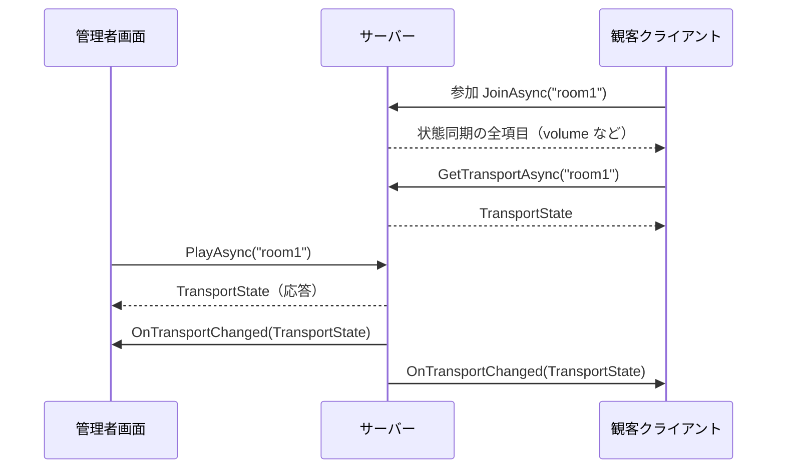

# サーバーとの通信（クライアント実装ガイド）

観客クライアントと管理者画面を実装する人向け。先に「考え方」と「やること」を書き、細かい仕様は後ろにまとめる。
用語は `Livisor.Server/Docs/Rules/glossary.md` に合わせる。

## 1. まず押さえること

1. サーバーは room ごとに「今の状態」を持っている。状態は 2 種類ある。**トランスポート**（再生中か、いつ始めたか、予約は何か）と、**状態同期**（音量や心拍数などの値）。
2. 管理者が操作すると、サーバーは状態を更新し、同じ room の全員に「新しい状態」を配る。「PLAY が押された」という操作そのものは配らない。
3. クライアントは、届いた状態をそのまま反映するだけでよい。前回の値を覚えて組み合わせる必要はない。
4. 予約（例: 再生開始の 10 秒後に音量を 30 にする）を実行するのはサーバーではなくクライアント。届いた状態から「あと何秒待つか」を計算してタイマーを張る。
5. 通信の入口は `RoomClient` 1 つ。MagicOnion を直接触らない。

## 2. 言葉

| 言葉 | 意味 |
|---|---|
| room | 状態を共有する単位。管理者と観客が同じ roomId で参加する。いまは `"room1"` |
| 参加 | Hub で room に入ること。入った時点の状態同期の全項目が返る |
| トランスポート | 再生状態。「再生中か」「再生開始のサーバー時刻」「予約アクション」を 1 つにまとめた `TransportState` で届く |
| 状態同期 | 音量や心拍数など、変わり続ける値の共有。変化した項目だけが `RoomStatePatch` で届く |
| 予約アクション | 「再生開始から t 後に、これをする」の 1 件。room ごとに 1 件だけ。新しい登録で置き換わる |
| 相対時間 | 再生開始を `00:00:00:00` とした経過時間。`HH:mm:ss:ff`（時:分:秒:センチ秒）。`00:01:30:00` は 90 秒後 |
| 発火 | 予約アクションの時刻になり、クライアントがそれを実行すること |
| 配信 | サーバーが同じ room の全接続へ通知を送ること。送った本人にも届く |

## 3. 仕組み

経路は 2 つ。**操作は Unary で送り、配信は StreamingHub で受ける。**

| 経路 | 何をするか | 契約 |
|---|---|---|
| Unary サービス | 管理者が操作を送る（再生開始・停止・予約の登録・予約の取消）。応答は送った本人だけに返る | `ITimelineService` |
| StreamingHub | room に参加する。音量などの値を送る。サーバーからの通知（トランスポート・状態同期）を受ける | `IRoomStateHub`、受信側 `IRoomStateHubReceiver` |



- 観客クライアントが Unary を使うのは、参加直後に `GetTransportAsync` を 1 回呼ぶときだけ。参加の応答にはトランスポートが入っていないため。
- 管理者が Unary で操作すると、応答が管理者に返ると同時に、同じ内容が `OnTransportChanged` で room の全員（管理者自身を含む）に届く。
- 音量は Hub の `PublishAsync` で送る。サーバーが room の状態に重ね、変化した項目だけを `OnStateChanged` で全員に配る。

## 4. 観客クライアントを作る

完成形は `Assets/Timeline/Scripts/TimelineReceiver.cs`。やることは 5 つ。

### 4.1 接続する

```csharp
[SerializeField] ServerConfig _config;      // Assets/Network/ServerConfig.asset（http://localhost:5210）
IRoomClient _client;

async void Start()
{
    _client = new RoomClient();
    _client.TransportChanged += OnTransport;   // トランスポートが届く
    _client.StateChanged += OnState;           // 状態同期が届く
    await _client.ConnectAsync(_config.ServerAddress, "room1");
}
```

`ConnectAsync` は「Hub に接続 → 参加 → トランスポートを 1 回取得」までやる。接続直後に `StateChanged` と `TransportChanged` が 1 回ずつ来るので、初期表示はそれで作る。

### 4.2 届いたものをメインスレッドへ渡す

通知は Unity のメインスレッド以外で届く。イベントの中で UI やシーンを触らず、キューに積んで `Update` で処理する。

```csharp
readonly ConcurrentQueue<TransportState> _transports = new();
readonly ConcurrentQueue<RoomStatePatch> _states = new();

void OnTransport(TransportState s) => _transports.Enqueue(s);
void OnState(RoomStatePatch p) => _states.Enqueue(p);

void Update()
{
    while (_states.TryDequeue(out var p)) ApplyState(p);
    while (_transports.TryDequeue(out var t)) ApplyTransport(t);
}
```

### 4.3 状態同期を反映する

届くのは変化した項目だけ。使うキーだけ拾い、知らないキーは無視する。

```csharp
void ApplyState(RoomStatePatch patch)
{
    foreach (var e in patch.Entries)
        if (e.Key == RoomStateKeys.Volume) _player.ChangeVolume(e.Value);   // e.Value.Number に音量
}
```

| 届く例 | 意味 |
|---|---|
| 参加の応答 `{ volume: 80, heartRate: 72 }` | 参加時点の全項目 |
| `{ volume: 30 }` | 音量だけ変わった。心拍数は前のまま |
| `{ heartRate: 95 }` | 心拍数だけ変わった。音量は前のまま |

### 4.4 トランスポートを反映する

`TransportState` は毎回 4 項目すべて入って届く。届くたびに、必ずこの順で 3 つ行う。

1. 張ってある発火タイマーを取り消す。取り消さないと古い予約が二重に発火する。
2. `Playing` で再生・停止を切り替える。
3. 予約があり、かつ再生中なら、待ち時間を計算してタイマーを張り直す。

```csharp
Coroutine _timer;   // 常に 0 本か 1 本

void ApplyTransport(TransportState state)
{
    if (_timer != null) { StopCoroutine(_timer); _timer = null; }              // 1
    _player.Play(state.Playing);                                              // 2
    if (TimelinePlayback.TryGetPendingAction(state, out var delay, out var action))
        _timer = StartCoroutine(FireAfter(delay, action));                    // 3
}

IEnumerator FireAfter(double delay, TimelineAction action)
{
    yield return new WaitForSecondsRealtime((float)delay);   // timeScale を 0 にしても止まらない
    _timer = null;
    Fire(action);
}
```

待ち時間は `TimelinePlayback.TryGetPendingAction` が次の式で出す。

```
待ち時間 = 相対時間 − (ServerTimeMs − StartedAtServerMs)
```

括弧の中は「サーバーが送った時点で、再生がどれだけ進んでいたか」。受け取った瞬間からこの時間だけ待つ。クライアントの時計は使わないので、時計のずれは影響しない。停止中はタイマーを張らない。待ち時間が負なら 0 として、すぐ実行する。

**計算例。** 予約 `00:00:10:00`（音量を 30 に）がある room で、管理者が操作したときに届く値と、受信側の動き。時刻は説明用。

| 管理者の操作 | 届く `TransportState` | 受信側がすること |
|---|---|---|
| PLAY（サーバー時刻 1,000,000） | 再生中、開始 1,000,000、送信 1,000,000、予約 `00:00:10:00` | 再生。10 − 0 = **10 秒後**に発火 |
| 再生中に予約を `00:00:15:00` に変更（1,004,000） | 再生中、開始 1,000,000、送信 1,004,000、予約 `00:00:15:00` | 前のタイマーを取消。15 − 4 = **11 秒後** |
| STOP（1,006,000） | 停止、開始 0、送信 1,006,000、予約 `00:00:15:00` | 停止。タイマー取消。予約は残るが張らない |
| PLAY（1,020,000） | 再生中、開始 1,020,000、送信 1,020,000、予約 `00:00:15:00` | 再生。新しい開始時刻から **15 秒後** |
| 再生中に予約を `00:00:02:00` に変更（1,025,000） | 再生中、開始 1,020,000、送信 1,025,000、予約 `00:00:02:00` | 2 − 5 < 0 なので **すぐ**発火 |
| CANCEL | 再生中、予約 null | タイマー取消。再生は続く |

### 4.5 発火する

```csharp
async void Fire(TimelineAction action)
{
    switch (action.Action)
    {
        case ActionType.Play:                       // 値は bool。true = 再生、false = 停止
            if (action.Value.Kind == ActionValueKind.Bool) _player.Play(action.Value.Bool);
            break;
        case ActionType.VolumeChange:               // 値は int
            _player.ChangeVolume(action.Value);
            // 予約で変えた音量は状態同期に書き戻す。全員が同じ予約を持つので、全員が同じ値を送る
            await _client.PublishStateAsync(new RoomStateEntry { Key = RoomStateKeys.Volume, Value = action.Value });
            break;
    }
}
```

書き戻した音量は `OnStateChanged` で自分にも戻り、同じ値を `ChangeVolume` にもう一度渡すことになる。結果は変わらない。

### 4.6 終了する

```csharp
async void OnDestroy() => await _client.DisposeAsync();
```

### 再生・音量の実行先

`IMediaPlayer` に `Play(bool)` と `ChangeVolume(ActionValue)` がある。

| 実装 | 用途 |
|---|---|
| `StageMediaPlayer` | ライブシーンの `StageDirector` を動かす本実装。再生・停止は音源と演出をまとめて切り替え、音量は Main 音源だけに効く |
| `LoggingMediaPlayer` | ログを出すだけ。`StageDirector` が無いシーン用 |

`TimelineReceiver` は `StageDirector` があれば `StageMediaPlayer`、無ければ `LoggingMediaPlayer` を使う。`Assets/Scenes/LiveScene.unity` に `TimelineReceiver` を置くと本実装で動く。

## 5. 管理者画面を作る

完成形は `Assets/Admin/Scripts/AdminConsoleView.cs`（`Assets/Admin/Scenes/Admin.unity`）。接続と通知の受け方は観客クライアントと同じ。違いはボタンで Unary を呼ぶこと。

### 5.1 ボタンと呼び出し

| ボタン | 呼び出し | 送る内容 | 戻り |
|---|---|---|---|
| CONNECT | `ConnectAsync(address, roomId)` | アドレス、roomId | 状態同期の全項目とトランスポートがイベントで届く |
| PLAY | `PlayAsync()` | roomId | `TransportState` |
| STOP | `StopAsync()` | roomId | `TransportState` |
| SCHEDULE | `ScheduleActionAsync(action)` | roomId と `TimelineAction` 1 件 | `TransportState` |
| CANCEL | `CancelScheduledActionAsync()` | roomId | `TransportState` |
| VOLUME | `PublishStateAsync(entry)` | `{ volume: N }` の 1 項目 | 無し。`OnStateChanged` で自分にも戻る |
| DISCONNECT | `DisposeAsync()` | 無し | 無し |

- PLAY / STOP は時刻を送らない。開始時刻はサーバーが決める。再生中に PLAY を押し直しても開始時刻は動かない。
- SCHEDULE は入力行を相対時間の昇順に並べ、先頭の 1 行だけを送る。サーバーの予約は 1 件だけ。
- VOLUME は roomId を送らない。参加時の room をサーバーが覚えている。

### 5.2 例

```csharp
// 再生開始の 10 秒後に音量を 30 にする
var state = await _client.ScheduleActionAsync(new TimelineAction
{
    Time = "00:00:10:00",
    Action = ActionType.VolumeChange,
    Value = ActionValue.From(30),
});
// state.ScheduledAction.Time == "00:00:10:00"

// 再生開始の 10 秒後に停止する
await _client.ScheduleActionAsync(new TimelineAction
{
    Time = "00:00:10:00",
    Action = ActionType.Play,
    Value = ActionValue.From(false),
});

// 音量を今すぐ 80 にする
await _client.PublishStateAsync(new RoomStateEntry { Key = RoomStateKeys.Volume, Value = ActionValue.From(80) });
```

### 5.3 表示の更新

Unary の応答と、その直後に届く `OnTransportChanged` は同じ値。応答で表示を更新し、通知でも同じ更新をしてよい。通知は非メインスレッドで届くので、観客クライアントと同じくキューに積んで `Update` で反映する。

## 6. データの形

`TransportState`（毎回 4 項目すべて入る）

| 項目 | 型 | 意味 |
|---|---|---|
| `Playing` | bool | 再生中か |
| `StartedAtServerMs` | long | 再生開始のサーバー時刻（UTC ミリ秒）。停止中は 0 |
| `ServerTimeMs` | long | この通知を作ったサーバー時刻（送信時刻） |
| `ScheduledAction` | `TimelineAction?` | 予約アクション 1 件。無ければ null |

`TimelineAction`

| 項目 | 型 | 意味 |
|---|---|---|
| `Time` | string | 相対時間 `HH:mm:ss:ff` |
| `Action` | `ActionType` | `Play` または `VolumeChange` |
| `Value` | `ActionValue` | `Play` なら bool、`VolumeChange` なら int |

`RoomStatePatch` は `Entries`（`RoomStateEntry[]`）と `ServerTimeMs`。`RoomStateEntry` は `Key`（string）と `Value`（`ActionValue`）。
`ActionValue` は int / bool / string のどれか 1 つを持つ。`ActionValue.From(30)` のように作る。`Kind` で種類、`Number` / `Bool` / `Text` で値を読む。

状態同期のキー

| キー | 型 | 備考 |
|---|---|---|
| `RoomStateKeys.Volume`（`"volume"`） | int | 音量 |
| `RoomStateKeys.HeartRate`（`"heartRate"`） | int | 心拍数 |
| それ以外 | int / bool / string | 照明の色など、増やしてよい。`playing` は送らない（再生状態はトランスポートが正） |

## 7. サーバーに拒否されるとき

呼び出しが `RpcException` になる。`StatusCode` で見分ける。

| 状況 | `StatusCode` | 直し方 |
|---|---|---|
| roomId が空または空白 | `InvalidArgument` | 空でない roomId を渡す |
| `Time` が `HH:mm:ss:ff` でない（`"00:00:10"`、`"00:00:60:00"` など） | `InvalidArgument` | 4 区切り、各欄 0–23 / 0–59 / 0–59 / 0–99 |
| `Action` と `Value` の種類が合わない（`Play` に int など） | `InvalidArgument` | `Play` は bool、`VolumeChange` は int |
| `volume` / `heartRate` に int 以外 | `InvalidArgument` | int を送る |
| 状態同期のキーが空 | `InvalidArgument` | キーを入れる |
| 参加する前に `PublishAsync` | `FailedPrecondition` | 先に `ConnectAsync`（参加）を終える |
| サーバーに届かない（未起動、ポート、`https://` にしている） | 接続や呼び出しが `RpcException` | `http://ホスト:5210` を確認 |

## 8. 決まりごと

- 予約アクションは room ごとに 1 件。新しい登録が前の 1 件を置き換える。停止しても残る。消すのは CANCEL だけ。
- 予約の時刻は相対時間。絶対時刻を入れても形式が同じなので拒否されず、別の時刻で発火する。
- 音量などの値の範囲（0〜100 など）はサーバーで検証しない。画面側で制限する。
- 通信の片道の遅れはそのまま発火の遅れになる。補正はしない。
- サーバーの room はメモリ上にある。サーバーを再起動すると room は空になり、Hub の接続も切れる。
- 自動再接続は無い。切断を知るには Hub の `WaitForDisconnectAsync()` を待つ（`RoomClient` はまだ公開していないので、必要なら足す）。再接続は `DisposeAsync` してから `ConnectAsync` をやり直す。

## 9. 環境

| 項目 | 内容 |
|---|---|
| サーバーのアドレス | `http://ホスト:5210`。HTTP/2 だけを受ける。`Assets/Network/ServerConfig.asset` で設定 |
| 通信ライブラリ | MagicOnion 7.10.2（`Assets/Packages`）。シリアライズは MessagePack |
| 通信契約 | `Livisor.Shared`。`Packages/manifest.json` から `file:../../Livisor.Shared` で参照 |
| チャネルの初期化 | `Assets/Scripts/MagicOnionInitializer.cs` がシーン読み込み前に行う。HTTP/2 専用の `YetAnotherHttpHandler` |
| IL2CPP（Meta Quest） | `Assets/Scripts/MagicOnionClientInitializer.cs` の `[MagicOnionClientGeneration(typeof(ITimelineService), typeof(IRoomStateHub))]` が必要。無いと接続時に落ちる。エディタでは無くても動くので気づきにくい |

## 10. 動作確認

サーバーを起動してから、Unity のメニューで実行する。結果は `SmokeTestResult.json` / `SmokeTestAdminResult.json`（Git 管理外）。

| メニュー | 確認する内容 |
|---|---|
| `Livisor/Smoke Test` | `Assets/Scenes/Sandbox.unity` の `TimelineReceiver` が再生・予約・音量を受けて反映する |
| `Livisor/Smoke Test (Admin)` | 管理者画面のボタンが送信し、応答で表示が変わる |
| `Livisor/Smoke Test (Admin, all features)` | 管理者画面の全機能と、別接続の観客クライアントへの配信 |

手で確かめるときは、Sandbox を再生してから Admin の画面で操作し、Console に次のログが出ることを見る。

```
[Receiver] joined room 'room1'
[Receiver] transport: playing=False scheduled=none        ← 接続直後の取得
[Receiver] transport: playing=True scheduled=00:00:10:00  ← PLAY の通知
```

## 11. よくある間違い

| 間違い | 何が起きるか | 直し方 |
|---|---|---|
| 通知のイベントの中で UI やシーンを触る | 別スレッドからの操作で例外や不定動作 | キューに積んで `Update` で反映する（4.2） |
| トランスポートが届いたときに古いタイマーを消さない | 予約が二重に発火する | 先に取り消してから張り直す（4.4） |
| 予約の時刻に絶対時刻を入れる | 拒否されず、別の時刻で発火する | 再生開始からの相対時間で入れる |
| `Play` の値に int、`VolumeChange` の値に bool を入れる | `InvalidArgument` で拒否 | `Play` は bool、`VolumeChange` は int |
| 参加する前に音量を送る | `FailedPrecondition` で拒否 | `ConnectAsync` の完了を待つ |
| 状態同期に `playing` を送る | 拒否はされないが、再生状態が二重になり食い違う | 再生状態はトランスポートだけを見る |
| IL2CPP で `[MagicOnionClientGeneration]` に契約を書き忘れる | Quest 実機で接続時に落ちる。エディタでは動く | 使う契約をすべて列挙する |
| `WaitForSeconds` で発火を待つ | 停止中に `timeScale` を 0 にすると止まる | `WaitForSecondsRealtime` を使う |

## 12. チェックリスト

- [ ] `ConnectAsync` の直後に `StateChanged` と `TransportChanged` が 1 回ずつ来ることを前提に初期表示を作った
- [ ] 通知はキューに積み、`Update` で反映している
- [ ] トランスポートが届くたびに、タイマー取消 → 再生切替 → タイマー張り直し、の順で処理している
- [ ] 発火待ちは `WaitForSecondsRealtime` で待っている
- [ ] 予約の `Time` は相対時間 `HH:mm:ss:ff` で送っている
- [ ] `Play` は bool、`VolumeChange` は int を入れている
- [ ] `VolumeChange` の発火後に `volume` を書き戻している
- [ ] 知らない状態キーを無視している
- [ ] `MagicOnionClientInitializer` に使う契約を列挙した
- [ ] 終了時に `DisposeAsync` している
